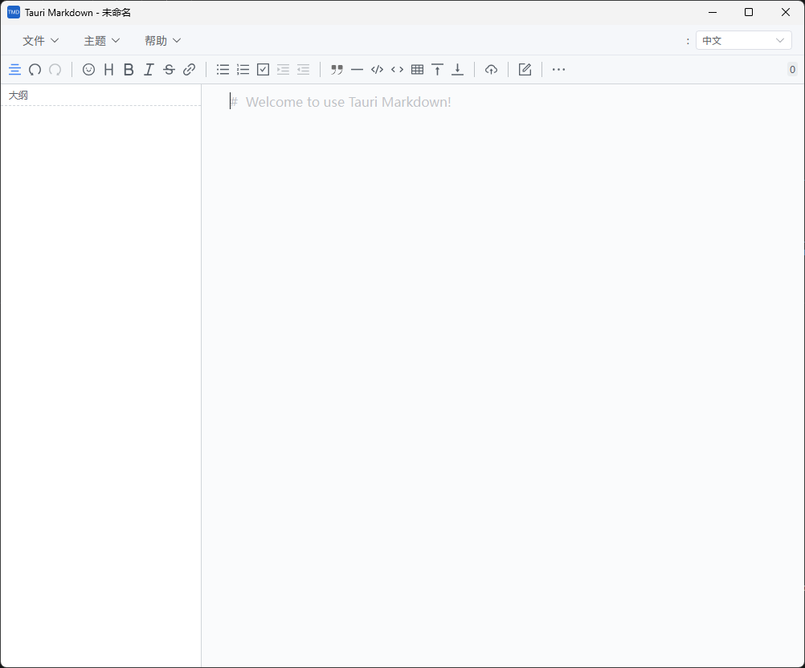
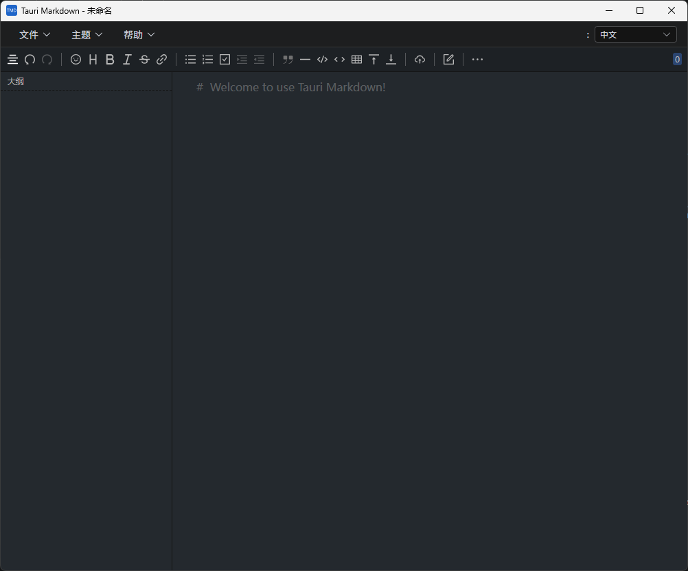

# Tauri Markdown
一个简单的本地 Markdown 工具, 使用 Tauri &amp; Vditor &amp; Vue3

我们也可以叫它 `TMD` ? 🤔

[English](README.md)

(tag v0.1.0 used vue2)

## 截图展示

### 浅色主题


### 深色主题


## 下载

从 [GitHub Releases](https://github.com/jeeinn/tauri-markdown/releases) 获取最新版本。

## 更新日志

查看 [CHANGELOG.md](CHANGELOG.md) 了解所有版本更新。

## 开发说明

### 安装 Tauri && tauri-bundler

查看 Tauri 官方文档: [文档](https://tauri.app/v1/guides/)

### 项目配置

```
npm install
```

### 开发和热更新

```
npm run tauri dev
```

### 编译发布

```
npm run tauri build
```

## 路线图
查看: https://github.com/jeeinn/tauri-markdown/discussions/1

## 感谢
* [tauri](https://github.com/tauri-apps/tauri)
* [vditor](https://github.com/Vanessa219/vditor)
* [element-plus](https://github.com/element-plus/element-plus)

> 项目 0.3.0+ 由阿里 Lingma 和小米 Mimo-v2.5-pro 合力编程完成。